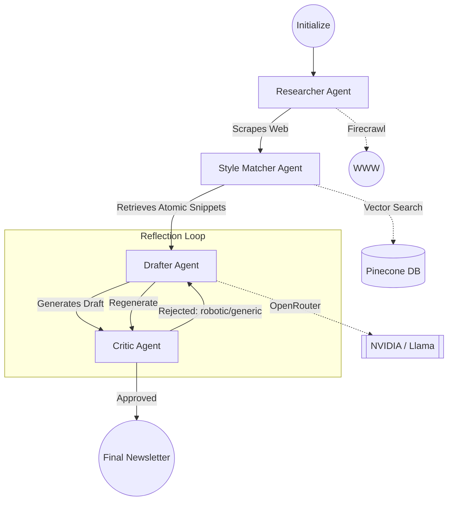

# flowPatch | Agentic AI Newsletter Engine

> **Stop Prompting. Start Orchestrating.**

flowPatch is an agentic AI platform designed for high-craft newsletter creation. It goes beyond simple prompting by using a collaborative multi-agent system to research, learn a user's writing style through **Atomic RAG**, and self-critique output until it's human-grade.

## 🚀 Key Features
- **Multi-Agent Orchestration:** Researcher, Style Matcher, Drafter, and Critic agents collaborating in a sophisticated state machine.
- **Atomic RAG:** A retrieval strategy that chunks content by *intent* (Hooks, Transitions, CTAs, Storytelling) rather than arbitrary length, ensuring high-fidelity style transfer.
- **Autonomous Reflection Loop:** A "harsh editor" Critic Agent that triggers automatic rewrites if the output is generic or contains robotic AI language.
- **Real-Time Thinking UI:** An industrial "Agentic Brutalism" interface built with Next.js 14 that streams agent reasoning via Server-Sent Events (SSE).
- **Secure Multi-Tenancy:** Robust Email & Password authentication with strict data isolation for user history and agent runs.

## 🧠 Agentic Workflow
The system is orchestrated by a custom state machine built with **LangGraph.js**, ensuring reliable, traceable, and self-correcting AI behavior.



## 🛠 Tech Stack
- **Frontend:** Next.js 14 (App Router), TailwindCSS, Framer Motion, Lucide React.
- **AI Engine:** LangGraph.js, OpenRouter (NVIDIA Nemotron 340B & Llama 3.1 8B).
- **Persistence:** PostgreSQL (Neon/Supabase), Prisma ORM, Pinecone (Vector Database).
- **Infrastructure:** TypeScript Monorepo architecture with shared packages for clean separation of concerns.

## 📦 Project Structure
```text
├── apps/
│   └── web/          # Next.js 14 Dashboard & Reader UI
├── packages/
│   ├── engine/       # Core LangGraph state machine & agent nodes
│   ├── ai/           # OpenRouter & Embedding model clients
│   ├── db/           # Prisma client & Pinecone integration
│   ├── types/        # Shared TypeScript interfaces
│   └── utils/        # Scrapers (Firecrawl) & text processing
└── prisma/           # Database schema
```

## 🛠 Getting Started

### 1. Prerequisites
- **OpenRouter API Key**
- **Pinecone API Key**
- **Firecrawl API Key**
- **PostgreSQL Database**

### 2. Installation
```bash
# Install dependencies
npm install --legacy-peer-deps

# Configure environment
cp .env.example .env
# [Fill in your API keys]

# Push database schema
npm run db:push --workspace=@flowpatch/db

# Build all packages
npm run build

# Start the platform
npm run dev
```

---
*Created as a high-impact portfolio piece for AI Engineering Internship applications.*
